# Projects
Below are some projects I have produced to show off some of my skills and knowledge of data science/data analytics. The links to all the GitHub repositories are here:

- [Medical insurance cost model - Regression with deep learning](https://github.com/lcwhite29/Project-Regression)
- [Grouping IPL Cricketers -  Clustering](https://github.com/lcwhite29/Project-Clustering)
- [Diabetes Classifier - Classification with deep learning](https://github.com/lcwhite29/Project-Classification)
- [What does Naive Bayes know about (Bumble) dating reviews? - NLP](https://github.com/lcwhite29/Project-NLP)

However, I have added the README of each project below to save you from clicking on the repositories. The links to the GitHub repositories are also in the titles below.

# [Medical insurance cost model - Regression with deep learning](https://github.com/lcwhite29/Project-Regression)

- This project attempts to find a model that can accurately predict the price of medical insurance.
- The data used in this project comes from a [raw](https://raw.githubusercontent.com/stedy/Machine-Learning-with-R-datasets/master/insurance.csv) data source.
- This project includes data exploration using libraries such as Seaborn, Matplotlib, Pandas and NumPy.  Using these libraries, I explored the possible correlations between insurance prices and the six different characteristics of a particular person.
- I initially used sklearn to develop a linear regression model to predict insurance prices. This linear regression model had an absolute error of around **$4000**, and the square root of the mean squared error was around **$6000**.
- Below is an image of the correct values against the predictions.

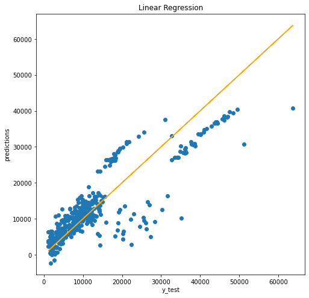

- To improve this model, I decided to drop some of the insurance prices in the excessive price range (outliers) as the model found these hard to predict. My idea was that, by dropping these outliers, I might improve the predictions for most insurance prices.
- Doing this improved the results as the absolute error dropped to around **$2500**, and the square root of the mean squared error dropped close to **$4250**.
- Below is an image of the correct values against the predictions for the new model.

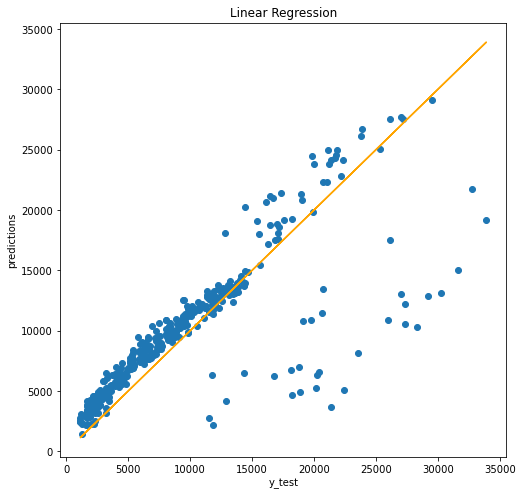

- The linear regression model did have a lower error when considering data not in the excessive price ranges.
- To try and improve my predictions, I decided to make a deep learning model using neural networks. Using TensorFlow and Keras, I made a new regression model.
- I tested this model on the same dataset again without the outliers.
- This deep learning model has an absolute error of around **$1500**, and the square root of the mean squared error is around **$4300**.

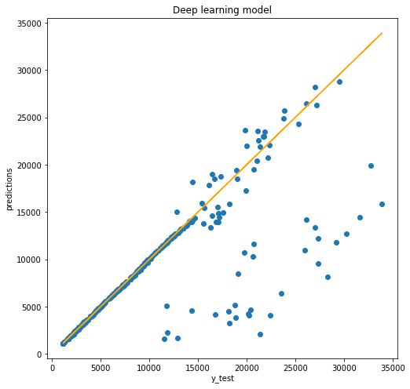

- The model is particularly good at predicting prices up to around $15000, but like the linear regression model, this model struggles to predict beyond that price.
- If I were to spend more time on this project, I would look more closely at what factors affect the price of someone's medical insurance costs. I would also seek more data to explain the outliers and some of the higher insurance prices.

# [Grouping IPL Cricketers -  Clustering](https://github.com/lcwhite29/Project-Clustering)

- In this project, I use data from the IPL 2023 to perform a k-means clustering algorithm that will split players into different categories depending on stats like the number of wickets they took and the number of runs they scored.
- The data used in this project comes from [Kaggle](https://www.kaggle.com/datasets/purnend26/ipl-2023-dataset).
- In particular, I was interested in determining which players had performed well with the ball and which had performed well with the bat in the IPL 2023. To do this required a lot of data manipulation, including concatenation of the bowling and batting datasets using an inner join.
- Using sklearn’s KMeans clustering algorithm, I clustered the players into three groups according to runs scored and wickets taken. Roughly the three groups were players who scored more than 200 runs, players with more than eight wickets and players with less than eight wickets and less than 200 runs. From this, someone can work out using the data frame which players did well with the bat and which players did well with the ball in particular. Using Seaborn, I could then visualise the results.

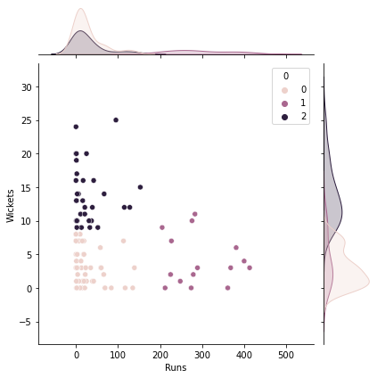

- Next, I did the same but for the outer joint.
- For this example, the groups are roughly players who scored more than 200 runs, players with more than six wickets and players with less than six wickets and less than 200 runs. 

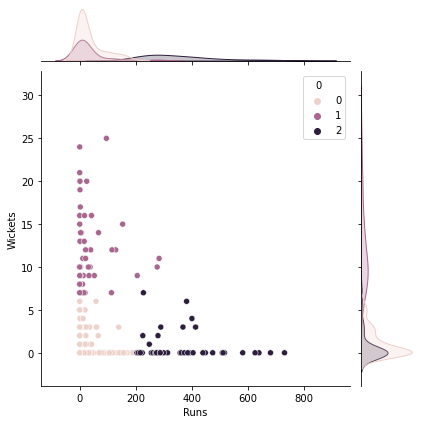

- This is a good visualization showing some insights of the IPL 2023.
- There are plenty more things that I could do with this dataset. Including working out which players had the most impact in the tournament.
- If there are similar datasets from previous years, then I could use these to see how players have performed across multiple IPLs.
- Sports trading companies can use these sorts of projects to help inform their trades for different tournaments.

# [Diabetes Classifier - Classification with deep learning](https://github.com/lcwhite29/Project-Classification)

- This project is designed to classify which patients have diabetes, given some biological data about the patients.
- The dataset used in the project comes from [Kaggle](https://www.kaggle.com/datasets/ashishkumarjayswal/diabetes-dataset?resource=download).
- This project included data exploration and visualisation using several Python libraries such as Seaborn, Matplotlib, Pandas and NumPy.
- Image of the headmap of correlations below.

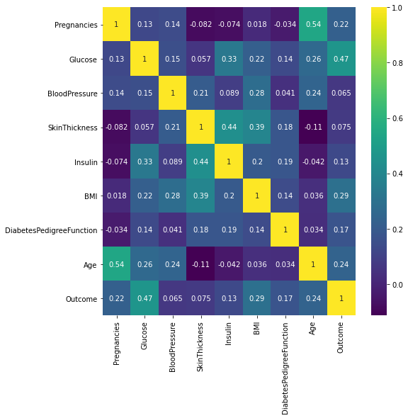

- Using sklearn, I created a logistic regression model that I then tested using a train test split. The logistic regression model has an accuracy of **0.79**. A reasonable degree of accuracy given there are only eight columns of biological data within the dataset.
- Image of the confusion matrix.

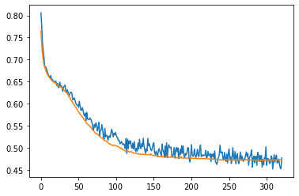

- After looking at the logistic regression model, I tried to find an improved model using deep learning.
- Using TensorFlow and Keras, I developed a classification model.
- Image of the loss and val_loss plot.

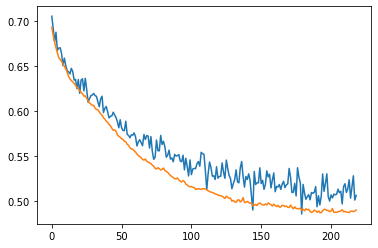

- This new model has the same accuracy of **0.79**. However, it might be a better model to use in some medical contexts as it is more likely to predict that people have diabetes. Therefore, it may be better than the logistic regression model as an initial warning for diabetes in patients.
- Image of the confusion matrix.

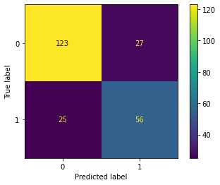

- If I could spend more time on this project, I would try to optimise the model more. I would also collect additional patient data as this could help to refine the model.

# [What does Naive Bayes know about (Bumble) dating reviews? - NLP](https://github.com/lcwhite29/Project-NLP)

- I explored 2000 Bumble dating reviews from the Apple app store for this project. I wanted to develop a model that is able to determine if a particular review of the app is good or bad. In this project, I decided that a good review was four or more and a bad review was less than four. I also wanted to see which words occurred the most for different ratings.
- I started by doing exploratory data analysis using Python libraries such as Seaborn, Matplotlib, Pandas and NumPy. I initially worked out how many 1, 2, 3, 4 and 5-star reviews are in the dataset.
- This is easy to do using Python. As we see in this first diagram, there are several 1-star reviews in this data set. I take this into account when considering the accuracy of the model later.

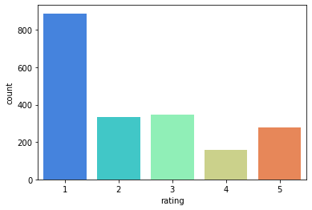

- Before using Natural Language Processing, I wanted to see if the length of the title or review had a correlation with the rating. I decided to introduce two new columns to the data frame. They are the review length and the title length columns. If you look at the word count of the reviews for the different ratings, you can see that reviews with lower ratings are typically longer. The box plot below shows just this. It is also the case that the titles are slightly longer for reviews with lower ratings; however, the correlation for this is weaker than for the review length.

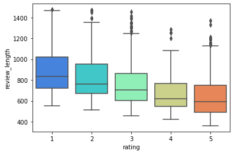

- The first model that I use here is Naive Bayes.
- Before starting to make the model I first made a new column which is a 1 if the review is 4 or more and 0 if the review is less than 4.
- To make the model I started by using sklearn's CountVectorizer which I fitted and transformed to the reviews variable.
- Then using sklearn's train test split and MultinomialNB I was able to predict if a review was good or not.
- This model has an accuracy of **0.83**. This is better than if we had made the guess that all the reviews are bad which has an accuracy of 0.78.
- Below is the confusion matrix for the Naive Bayes model. 

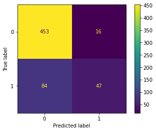

- The second model I tried out is a random forest classifier.
- For this model, I also imported stopwords from nltk and string. I used these to make a function to remove punctuation and stopwords from the reviews. I thought that this might improve the accuracy of the model.
- Then I imported the TfidfTransformer, the Pipeline and the RandomForestClassifier from sklearn.
- Once I fitted and predicted using the model, the classification report gave the model an accuracy of **0.84**, slightly higher than the previous model.
- Below is the confusion matrix for the random forest classifier model. Note that this model in comparison to the previous model is more likely to classify good reviews as bad reviews.

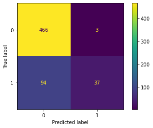

- Using a word cloud I can find the most popular words for different ratings.
- The first word cloud here is for reviews with a rating of 1 star.

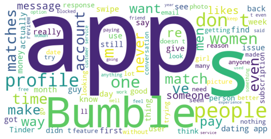

- The second word cloud here is for reviews with a rating of 5 stars.

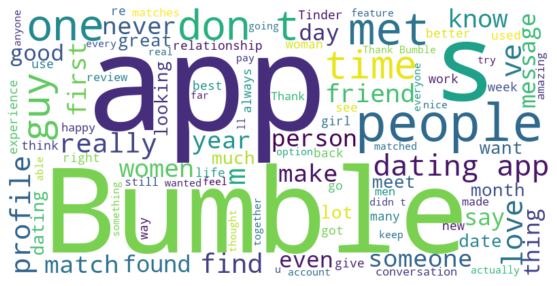

- If I spent more time on this project, I would look into improving the different model's performances by adding additional features like the length of the review and title. I would also use the same models but replace the review text with the title text. Further, I would look at combining the title and review texts together and then producing a model on the combined text.
- Additionally, I would do a more sophisticated word count as this would be beneficial from a business intelligence point of view to understand what people like and dislike about the app. Knowing this could help Bumble improve certain aspects of the app that would improve their reviews and the overall performance of Bumble in the dating app market.
